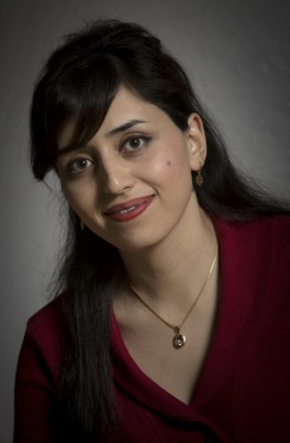
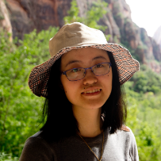
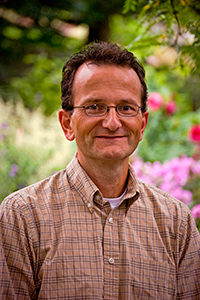
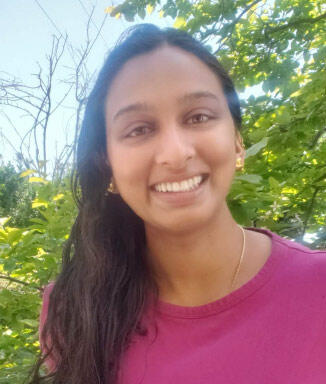

# Organizers

[**Shima Alizadeh**](https://www.linkedin.com/in/shima-alizadeh-4853b340/) is an Applied Scientist at AWS AI Labs at Amazon Web Services working on diverse machine learning problems including SciML/AI4Science, Multi-Objective Optimization (MOO), higher order optimization methods, personalization, and recommendations. Prior to joining AWS AI Labs she worked at Adobe as Machine Learning Engineer/Researcher for time-series forecasting problems with applications for intelligent marketing. She received her PhD in Mechanical Engineering from Stanford University with focus on high performance computing (HPC) for computational engineering, where she designed and implemented robust multi-scale models to study physical problems that involve transport phenomena and fluid dynamics. Shima’s passion lies at the interface of HPC for computational physics and Artificial Intelligence to solve problems that are governed by Physics based PDEs and ODEs with various applications such as climate research, transport phenomena, and engineering design optimization. At AWS AI Labs, by leveraging her expertise in HPC, numerical methods, machine learning, and optimization, she has been working on different problems such as Physics-Guided Neural Operators, Uncertainty Quantification (UQ) for SciML models, and ML models that respect physics constraints.

[**Neil Ashton**](https://www.linkedin.com/in/neilashton/)
is a Principal Computational Engineering Specialist at Amazon Web Services (AWS), as well as being a fellow of the Institute of Mechanical Engineering (IMechE). He leads the Amazon-wide Computational Fluid Dynamics (CFD) working group and acts as a CFD subject matter expert across the diverse departments using CFD at Amazon. Prior to joining AWS he obtained a Masters and Ph.D. at the University of Manchester focusing on turbulence modeling, and previous positions were at the University of Oxford, NASA Ames Research Center, and Lotus Formula 1 Team, as well as consultancy roles for a range of automotive and aerospace companies . His expertise is on applying and developing the next generation of CFD approaches with a particular focus on interplay between high-fidelity turbulence models, machine learning and high-performance computing. He created the Automotive CFD Prediction Workshop (whose 4th edition is happening in September 2024), and leads the hybrid RANS-LES technical working group for the 5th AIAA High-Lift Prediction CFD Workshop. In the past year his particular focus has been spearheading the development of industrialized versions of ML methods (e.g MeshGraphNet) that can be used to accelerate the engineering design process. 

[**Vitus Benson**](https://www.bgc-jena.mpg.de/person/vbenson/4777761)
is an ELLIS PhD student at Max Planck Institute for Biogeochemistry, ELLIS Unit Jena and ETH Zürich. He leverages machine learning to deepen our understanding of the Earth and climate sciences. In particular he is working on data-driven modeling of the carbon cycle.
For this he is emulating an atmospheric transport model with deep learning. Furthermore he is interested in inverse modeling with PDEs. In addition he is a leading member of the EarthNet team, where he develops deep neural networks to predict the influence of weather on vegetation, his models can be used to estimate the localized impacts of weather extremes, towards improved early warning and to enhance humanitarian anticipatory action. Prior to his current work, he received a M.Sc. in Mathematical Physics from Leipzig University and a B.Sc. in Mathematics from the University of Göttingen. His research interests are broadly speaking Deep Learning, Biogeochemistry, Climate Risk Mitigation and Scientific Computing.

[**Boran Han**](https://www.linkedin.com/in/boran-han-ba753966/) is an Applied Scientist in the DeepEarth Group at AWS AI Research and Education. She earned her Ph.D. in biophysics from Harvard University under the guidance of Prof. Xiaowei Zhuang. Throughout her doctoral journey, she delved into pioneering super-resolution imaging techniques, with her research being published in esteemed journals such as Science and Cell, among others. Upon completion of her Ph.D., she joined Shell, where she leveraged deep learning to expedite seismic reconstruction, a complex inverse problem. Since joining AWS, Boran has redirected her research focus towards the development of multimodal foundation models specifically designed for scientific applications. One of her primary objectives has been to enhance the accuracy, robustness and explainability/interpretability of these foundation models. Additionally, she is dedicated to developing new foundation models tailored for scientific applications. Her commitment to merging advanced AI techniques with scientific challenges places her at the forefront of this dynamic interdisciplinary field.

[**George Karypis**](https://cse.umn.edu/cs/george-karypis) is a Distinguished McKnight University Professor in the Department of Computer Science & Engineering at the University of Minnesota. He received his B.S. and Ph.D. in Computer Science from the University of Minnesota. He joined the Department of Computer Science & Engineering in 1999. He was promoted to full professor in 2009. He is the co-author of two books and has contributed to the development of multiple software libraries.  Additionally, he serves on the program committees of many conferences and workshops, and on the editorial boards of the IEEE Transactions on Big Data, ACM Transactions on Knowledge Discovery from Data, Data Mining and Knowledge Discovery, Journal of Data Science and Analytics, Social Network Analysis and Data Mining Journal, International Journal of Data Mining and Bioinformatics, the journal on Current Proteomics, Advances in Bioinformatics, and Biomedicine and Biotechnology. He is an IEEE Fellow.

[**Aditi Krishnapriyan**](https://a1k12.github.io/) is an Assistant Professor of Chemical and Biomolecular Engineering; Electrical Engineering and Computer Sciences at the University of California, Berkeley.  She is a Bruce and Susan Stangeland Processor and Member of the Berkeley AI Research (BAIR). Her research interests are focused on developing machine learning methods that are motivated by the opportunities and challenges in science and engineering. Some of the areas of exploration include approaches to incorporate physical inductive biases into ML models to improve generalization, the advantages that ML can bring to classical physics-based numerical solvers (such as through end-to-end differentiable frameworks and implicit layers), and better learning strategies for distribution shifts in the physical sciences. Her foundational research is informed by and grounded in applications in physics, fluid and molecular dynamics, materials design, climate science, and other related areas. Her work also includes interfacing with other fields including numerical methods, dynamical systems theory, quantum mechanical simulations, computational geometry, and optimization.

[**Danielle Maddix Robinson**](https://dcmaddix.github.io/) is a Senior Applied Scientist in the Machine Learning Forecasting Group within AI Research and Education at Amazon Web Services (AWS). She graduated with her PhD in Computational and Mathematical Engineering from the Institute of Computational and Mathematical Engineering (ICME) at Stanford University. She was advised by Professor Margot Gerritsen and developed robust numerical methods to remove spurious temporal oscillations in the degenerate Generalized Porous Medium Equation. She is passionate about the underlying numerical analysis, linear algebra and optimization methods behind numerical PDEs and applying these techniques to deep learning. She joined AWS in 2018 shortly after graduating, and has been working on developing statistical and deep learning models for time series forecasting. In this past year, she has been leading the research initiative on developing models for physics-constrained machine learning for scientific computing on the DeepEarth team. In particular, she has researched how to apply ideas from numerical methods, e.g., finite volume schemes, to improve the accuracy of black-box ML models for ODEs and PDEs with applications to epidemiology, aerodynamics, ocean and climate models.

[**Michael W. Mahoney**](https://www.stat.berkeley.edu/~mmahoney/) is at the University of California at Berkeley in the Department of Statistics and at the International Computer Science Institute (ICSI).  He is also a faculty scientist at the Lawrence Berkeley National Laboratory.  He works on algorithmic and statistical aspects of modern large-scale data analysis.  Much of his recent research has focused on large-scale machine learning, including randomized matrix algorithms and randomized numerical linear algebra, geometric network analysis tools for structure extraction in large informatics graphs, scalable implicit regularization methods, computational methods for neural network analysis, physics informed machine learning, and applications in genetics, astronomy, medical imaging, social network analysis, and internet data analysis.  He received his PhD from Yale University with a dissertation in computational statistical mechanics, and he has worked and taught at Yale University in the mathematics department, at Yahoo Research, and at Stanford University in the mathematics department.  Among other things, he is on the national advisory committee of the Statistical and Applied Mathematical Sciences Institute (SAMSI), he was on the National Research Council's Committee on the Analysis of Massive Data, he co-organized the Simons Institute's fall 2013 and 2018 programs on the foundations of data science, he ran the Park City Mathematics Institute's 2016 PCMI Summer Session on The Mathematics of Data, and he runs the biennial MMDS Workshops on Algorithms for Modern Massive Data Sets.  He is the Director of the NSF/TRIPODS-funded FODA (Foundations of Data Analysis) Institute at UC Berkeley.  

[**Markus Reichstein**](https://www.bgc-jena.mpg.de/en/reichstein) is Director of the Biogeochemical Integration Department at the Max-Planck-Institute for Biogeochemistry. His main research interests revolve around the response and feedback of ecosystems (vegetation and soils) to climatic variability with an Earth system perspective. Of specific interest is the interplay of climate extremes with ecosystem and societal resilience. He is addressing these topics with a combination of artificial intelligence and system modelling approaches to exploit the wealth of experimental, ground- and satellite-based Earth observations. Markus studied Ecology with Botany, Chemistry and Computer Science as minor and obtained his PhD in Plant Ecology at the University of Bayreuth, Germany. Since 2013, Markus has been Professor for Global Geoecology at the FSU Jena, and founding Director at the Michael-Stifel-Center Jena for Data-driven and Simulation Science. He is fellow within the excellence network ELLIS (European Laboratory for Learning and Intelligent Systems) and founding director of the ELLIS Unit Jena established in 2021. He has been serving as lead author of the IPCC special report on Climate Extremes (SREX), as member of the German Committee Future Earth on Sustainability Research, and the Thuringian Panel on Climate. Recent awards include the Piers J. Sellers Mid-Career Award by the American Geophysical Union (2018), an ERC Synergy Grant (2019) and the Gottfried Wilhelm Leibniz Preis (2020).

[**Yuyang (Bernie) Wang**](https://www.mit.edu/~ywang02/) is a Principal Machine Learning Scientist in Amazon AI Labs, working mainly on large-scale probabilistic machine learning with its application in Forecasting. He received his PhD in Computer Science from Tufts University, MA, US and he holds an MS from the Department of Computer Science at Tsinghua University, Beijing, China. His research interests span statistical machine learning, numerical linear algebra, and random matrix theory. In forecasting, Yuyang has worked on all aspects ranging from practical applications to theoretical foundations.

[**Andrew Gordon Wilson**](https://cims.nyu.edu/~andrewgw/) is an Associate Professor in the Courant Institute of Mathematical Sciences and Center for Data Science at New York University. His work is focused on developing a prescriptive understanding of model construction and generalization, often working with probabilistic and Bayesian methods. His research agenda includes uncertainty representation, scalable inference, physics-inspired machine learning, neural networks for differential equations, and many scientific applications, including protein engineering, spatiotemporal modelling, general relativity, and medical diagnosis. He has organized over 10 highly successful workshops across NeurIPS and ICML, including a major NeurIPS 2017 symposium on interpretable machine learning. Andrew also co-organized the NeurIPS 2021 competition for approximate inference in Bayesian deep learning, has been the EXPO Chair for ICML 2020, 2021, and is the Tutorial Chair for NeurIPS 2022, 2023, and will be the Workshop Chair for ICML 2024. He was also the ICML 2020 tutorial speaker in Bayesian deep learning.

[**Mahkameh (Maggie) Zarekarizi**](https://www.linkedin.com/in/mahkameh/) is a Research Scientist in the World Wide Sustainability group at Amazon Web Services (AWS). She is a climate science subject matter expert across business units that work on or are impacted by environmental hazards. Her research involves the projection and uncertainty quantification of climate-related risks across various hazards and geographies. She uses Decision Making Under Deep Uncertainty (DMDU) techniques to help stakeholders make robust decisions to manage and mitigate their climate risk. Before joining Amazon, Maggie was a data scientist at Jupiter Intelligence, where she led the development of high-resolution global flood and drought risk models leveraging data-driven and machine learning approaches. She completed a postdoctoral scholarship at the Earth and Environmental Systems Institute at Penn State and earned her PhD from the Maseeh College of Engineering at Portland State University. Her PhD research involved assimilating real-time satellite observations into Earth system models to improve their accuracy in forecasting environmental hazards.

