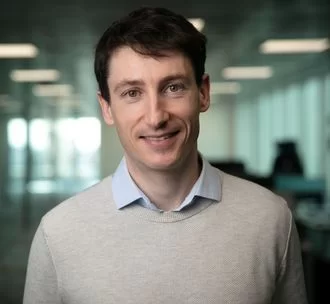
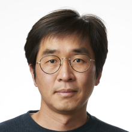
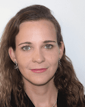
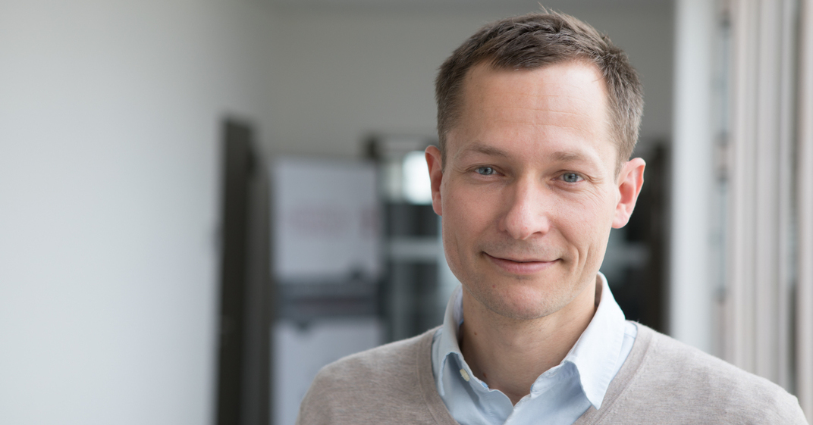
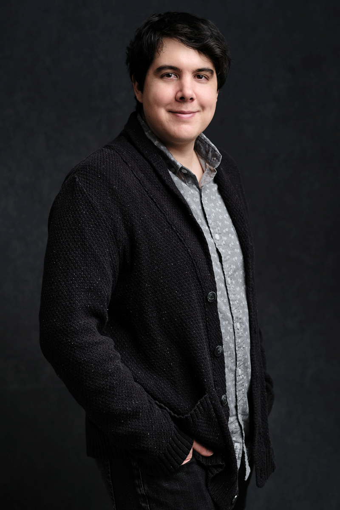
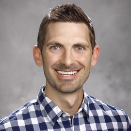
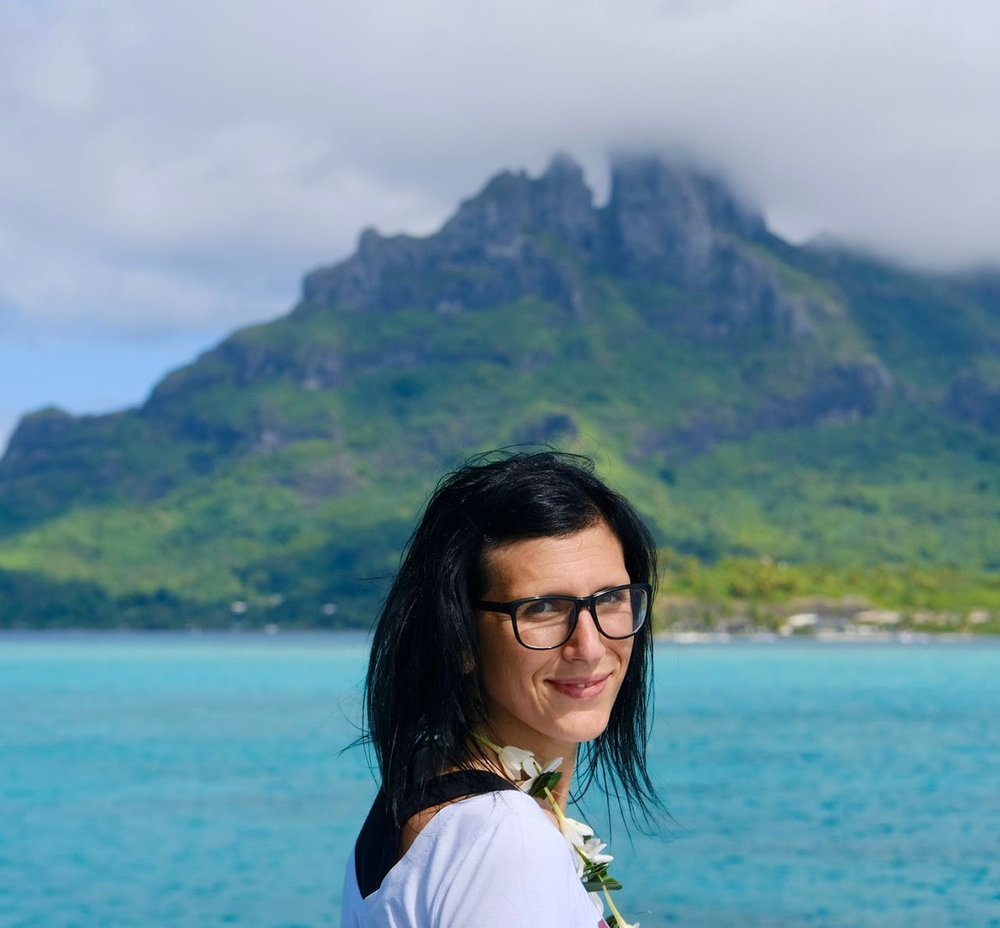
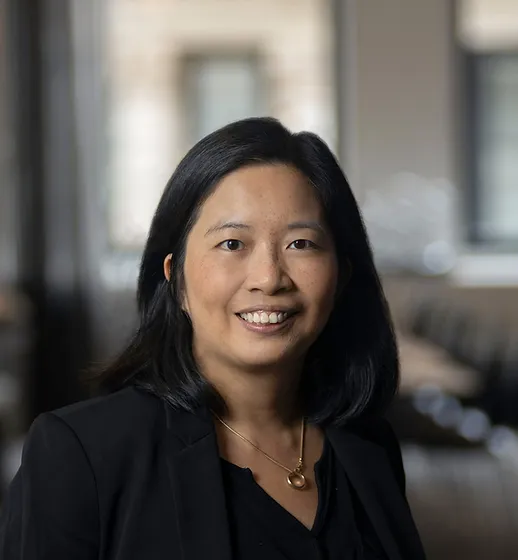

# Speakers

## Invited talks

[**Johannes Brandstetter**](https://www.jku.at/en/institute-for-machine-learning/about-us/team/ass-prof-dr-johannes-brandstetter/)
 is an Assistant Professor at Johannes Kepler University in Linz and a Guest Researcher at Microsoft Research Amsterdam, working on the intersection of deep learning and physics, aiming to accelerate partial differential equation solving and computational simulations. His research has spanned a range of topics from geometric deep learning, graph-structured learning, reinforcement learning, few-shot learning to particle and high-energy physics. Before starting his professorship, he was senior researcher at Microsoft, ELLIS postdoctoral researcher at the Amsterdam Machine Learning Lab (AMLAB) and at the Johannes Kepler University in Linz. He did his PhD at the CMS experiment at CERN investigating Higgs boson decays.

[**Steve Brunton**](https://www.me.washington.edu/facultyfinder/steve-brunton) is a James B. Morrison Endowed Career Development Professor in Mechanical Engineering and Adjunct Professor of Applied Mathematics at the University of Washington. He is also a Data Science Fellow at the eScience Institute. He received his Ph.D. in Mechanical and Aerospace Engineering from Princeton University in 2012 and his B.S. in Mathematics with a minor in Control and Dynamical Systems from the California Institute of Technology in 2006. His research focuses on combining techniques in dimensionality reduction, sparse sensing, and machine learning for the data-driven discovery and control of complex dynamical systems. He is also interested in how low-rank coherent patterns that underlie high-dimensional data facilitate sparse measurements and optimal sensor and actuator placement for control. He is developing adaptive controllers in an equation-free context using machine learning. Specific applications in fluid dynamics include closed-loop turbulence control for mixing enhancement, bio-locomotion, and renewable energy. Other applications include neuroscience, medical data analysis, networked dynamical systems, and optical systems.

[**Youngsoo Choi**](https://people.llnl.gov/choi15) is a computational math scientist in the Center of Applied Scientific Computing (CASC) under the Computing directorate at Lawrence Livermore National Laboratory (LLNL). His research focuses on developing efficient reduced order models for various physical simulations for time-sensitive decision-making multi-query problems, such as inverse problems, design optimization, and uncertainty quantification. His expertise includes various scientific computing disciplines. Together with his collaborators, he has developed various powerful model order reduction techniques, such as machine learning-based nonlinear manifold and space-time reduced order models for nonlinear dynamical systems. He has also developed the component-wise reduced order model optimization algorithm, which enables fast and accurate computational modeling tool for lattice-structure design. He is currently leading data-driven surrogate modeling development team for various physical simulations, with whom he developed the open source codes, libROM and LaghosROM. He is also involved with quantum computing research. He has earned his undergraduate degree for Civil and Environmental Engineering from Cornell University and his PhD degree for Computational and Mathematical Engineering from Stanford University. He was a postdoc at Sandia National Laboratories and Stanford University prior to joining LLNL in 2017.

[**Meire Fortunato**](https://research.google/people/meire-fortunato/) is a research scientist at DeepMind, which she joined in 2016. Meire received her undergraduate and master's degrees in Mathematics from University of Campinas in Brazil (in 2008 and 2010, respectively); and her PhD in Mathematics in 2016 from the University of California, Berkeley. Meire is co-founder and a member of the general committee of Khipu.ai, an effort to support and strengthen AI research in Latin America. Meire has worked on a variety of machine learning topics, such as sequence modeling and exploration and understanding the role of memory in reinforcement learning agents. In the last two years, Meire's research focus has been on how to use machine learning for physics simulations -- with emphasis on graph neural networks architectures. This links to her mathematics background, as her PhD thesis was on the generation of high-order meshes by solving partial differential equations with finite element methods.

[**Paula Harder**](https://paulaharder.github.io/) is a Ph.D. student in Computer Science at the Fraunhofer Institute for Industrial Mathematics (ITWM) and the Scientific Computing Group (SciComp) of the University of Kaiserslautern. She is supervised by Nicolas Gauger (SciComp) and Janis Keuper (ITWM). She also was an intern with David Rolnick at Mila, working on Physics-Constrained Climate Downscaling and a visiting researcher at the University of Oxford working on aerosol model emulation with Philip Stier and Duncan Watson-Parris.  Her key research interest is Deep Learning applications for Climate and Weather Modeling. In addition, she works on robustness in Deep Learning on the topic of Adversarial Attacks and is interested in any applications of ML to climate, earth, and space science, as well as in the broad field of AI for Social Good. She is involved with the NASA/ESA Frontier Development Lab, where she worked as an ML Scientist and returned as a team lead in 2022, looking into aerosols from wildfires. She received a master's degree in Mathematics with a specialization in Numerical Analysis from the University of Tübingen, where she also got an education in Machine Learning. During her master's she did research projects at the German Climate Computation Center and a company for simulation of electrical networks in her spare time. After graduating she worked as a Development Engineer in the automotive industry, both on software development projects as well as data science applications.

[**Jakob Macke**](https://www.mackelab.org/) is a Professor for “Machine Learning in Science” at the University of Tübingen. The W3 professorship has been set up as part of the Cluster of Excellence “Machine Learning: New Perspectives for the Sciences”. He is also an Adjunct Research Scientist at the Max Planck Institute for Intelligent Systems, Director of the Bernstein Center for Computational Neuroscience, and an ELLIS Fellow and member of the ELLIS Unit Tübingen.
Jakob studied mathematics at Oxford University, worked as a PhD student at the Max Planck Institute for Biological Cybernetics in Tübingen, as a postdoc at the Gatsby Unit at University College London, and as a Bernstein Fellow in Tübingen. He was a Max Planck Group Leader at the Caesar Research Centre in Bonn, a Professor at the Centre for Cognitive Science at TU Darmstadt, and from 2018 to 2020, Professor of Computational Neuroengineering at TU Munich. He was a member of the Young Academy at the German Academy of Sciences Leopoldina (2013-2018), and is currently a FENS Kavli Scholar of Excellence.

[**Christopher Rackauckas**](https://chrisrackauckas.com/) is a Research Affiliate and Co-PI of the Julia Lab at the Massachusetts Institute of Technology, Director of Modeling and Simulation at Julia Computing and Creator and Lead Developer of JuliaSim, Director of Scientific Research at Pumas-AI and Creator / Lead Developer of Pumas and Lead Developer of the SciML Open Source Software Organization. His research and software is focused on Scientific Machine Learning (SciML): the integration of domain models with artificial intelligence techniques like machine learning. By utilizing the structured scientific (differential equation) models together with the unstructured data-driven models of machine learning, our simulators can be accelerated, our science can better approximate the true systems, all while enjoying the robustness and explainability of mechanistic dynamical models. Chris's recent work is focused on bringing personalized medicine to standard medical practice through the proliferation of software for scientific AI. Chris is at the cutting edge of mathematical methods for scientific simulation. He is the lead developer of the DifferentialEquations.jl solver suite along with over a hundred other Julia packages, earning him the inaugural Julia Community Prize, an outstanding paper award at the IEEE-HPEC conference on computational derivation for the efficient stochastic differential equation solvers, and front page features on many tech community sites. Chris' work on high performance differential equation solving is the engine accelerating many applications from the MIT-CalTech CLiMA climate modeling initiative to the SIAM Dynamical Systems award winning DynamicalSystems.jl toolbox (of which DifferentialEquations.jl was the runner-up). His work is credited for the 15,000x acceleration of NASA Launch Services simulations and recently demonstrated a 60x-570x acceleration over Modelica tools. For these achievements Chris received the United States Department of the Air Force Artificial Intelligence Accelerator Scientific Excellence Award.

[**Alex Townsend**](https://pi.math.cornell.edu/~ajt/) is an Associate Professor of Mathematics at Cornell University. He received his Ph.D. from the University of Oxford in 2014. His research interests include numerical analysis, scientific computing, and deep learning. He is interested in the study and development of numerical algorithms in applied mathematics. In particular, he works mainly in the following three areas: (1) Novel spectral methods for the solution of differential equations, (2) Low-rank techniques, and (3) Theoretical aspects of deep learning.

## Panelists

[**Kevin Carlberg**](https://kevintcarlberg.net/) is an AI Research Science Manager at Meta Reality Labs Research and an Affiliate Associate Professor of Applied Mathematics and Mechanical Engineering at the University of Washington. He leads a multidisciplinary research team focused on enabling the future of interaction in augmented and virtual reality by developing AI breakthroughs across the domains of embodied AI, multimodal machine learning, conversational AI, and AI-accelerated computational physics. His individual research combines concepts from machine learning, computational physics, and high-performance computing to drastically reduce the cost of simulating nonlinear dynamical systems at extreme scale. Previously, Kevin was a Distinguished Member of Technical Staff at Sandia National Laboratories in Livermore, California, where he led a research group of PhD students, postdocs, and technical staff in applying these techniques to a range of national-security applications in mechanical and aerospace engineering.

[**Marta D’Elia**](https://sites.google.com/site/martadeliawebsite) is a Principal Research and Computational Scientist at Pasteur Labs and an Adjunct Professor at the Institute of Computational and Mathematical Engineering at Stanford University.  Previously, she was a Research Scientist at Meta and a Principal Member of the Technical Staff at Sandia National Laboratories, California. She works on the design and analysis of models and data-driven algorithms for the simulation of complex, multiscale and multiphysics problems. Her background and training have foundations in Numerical Analysis, Scientific Computing, Inverse Problems, Control and Optimization, and Uncertainty Quantification. In the past five years, she has focused on Scientific Machine Learning (SciML) and Deep Learning. She is an expert in Nonlocal/Fractional Modeling and Simulation with application to Continuum Mechanics, Subsurface Transport, Image Processing, and Turbulence. She has a master's degree in Mathematical Engineering from Politecnico di Milano (2007) and a PhD in Applied Mathematics from Emory University (2011).

[**Shirley Ho**](https://www.shirleyho.me/) joined the Physics Department as Research Professor and as an Affiliated Faculty at Center for Data Science at NYU in 2021. She joined the Simons Foundation in 2018 as leader of the Cosmology X Data Science group at CCA and in 2021, she assumed the role of CCA’s interim director. Her research interests have ranged from fundamental cosmological measurements to exoplanet statistics to using machine learning to estimate how much dark matter is in the universe. Ho has broad expertise in theory, observation and data science. Ho’s recent interest has been on understanding and developing novel tools in statistics and machine learning techniques, and applying them to astrophysical challenges. Her goal is to understand the universe’s beginning, evolution and its ultimate fate. She earned her Ph.D. in astrophysical sciences from Princeton University in 2008 and her bachelor’s degrees in computer science and physics from the University of California, Berkeley in 2004. She was a Chamberlain fellow and a Seaborg fellow at Lawrence Berkeley National Laboratory before joining Carnegie Mellon University in 2011 as an assistant professor. She became the Cooper Siegel Career Development Chair Professor and was appointed associate professor with tenure in 2016. She moved to Lawrence Berkeley Lab as a Senior Scientist in 2016. Since 2011, she has been a primary mentor to more than 35 postdoctoral fellows, 10 graduate students and 20 undergraduates in the fields of astrophysics, computer science and statistics. She has received several awards including NASA Group Achievement Award, Macronix Prize and Carnegie Science Award. She is also elected a Fellow by the International Astrostatistics Association.

[**Max Welling**](https://staff.fnwi.uva.nl/m.welling/) is a research chair in Machine Learning at the University of Amsterdam and a Distinguished Scientist at MSR. He is a fellow at the Canadian Institute for Advanced Research (CIFAR) and the European Lab for Learning and Intelligent Systems (ELLIS) where he also serves on the founding board. His previous appointments include VP at Qualcomm Technologies, professor at UC Irvine, postdoc at U. Toronto and UCL under supervision of prof. Geoffrey Hinton, and postdoc at Caltech under supervision of prof. Pietro Perona. He finished his PhD in theoretical high energy physics under supervision of Nobel laureate prof. Gerard‘t Hooft. He has served as associate editor in chief of IEEE TPAMI from 2011-2015, he serves on the advisory board of the NeurIPS foundation since 2015 and has been program chair and general chair of Neurips in 2013 and 2014 respectively. He was also program chair of AISTATS in 2009 and ECCV in 2016 and general chair of MIDL 2018. Max Welling is the recipient of the ECCV Koenderink Prize in 2010 and the ICML Test of Time award in 2021. He directs the Amsterdam Machine Learning Lab (AMLAB) and co-directs the Qualcomm-UvA deep learning lab (QUVA) and the Bosch-UvA Deep Learning lab (DELTA).

